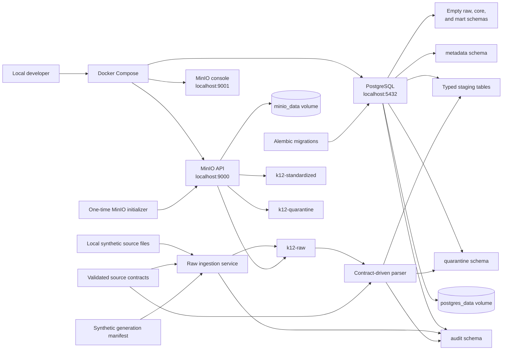

# Local Infrastructure Architecture

The local persistence layer uses PostgreSQL for operational metadata and typed staging data.
MinIO provides separate S3-compatible buckets for raw, standardized, and quarantined objects.
Alembic owns operational and source-aligned staging tables; dbt will own downstream analytical
transformation models in a later phase.



All credentials in `.env.example` are local-only defaults. Developers may override them in an
uncommitted `.env` file. Docker named volumes keep service state outside the repository.

## Database ownership

| Owner | Schemas and objects |
| --- | --- |
| Alembic | `metadata`, `audit`, `quarantine`, and source-aligned `staging` tables |
| dbt in a later phase | Analytical models in `raw`, `core`, and `mart` |

The initial migration creates all seven schema namespaces. It creates only operational tables:

- `metadata.source_system`, `metadata.data_contract`, and `metadata.data_quality_rule`
- `audit.pipeline_run`, `audit.source_file`, `audit.row_count_reconciliation`, and
  `audit.access_event`
- `quarantine.rejected_record`

The staging migration adds `staging.sis_student`, `staging.sis_enrollment`,
`staging.attendance_event`, and `staging.assessment_event`. No conformed student, attendance, or
analytical models exist yet.

## Raw ingestion boundary

Raw ingestion discovers local files from source-contract patterns and uses the synthetic
generation manifest only to identify the school year and verify the dataset label. It does not
parse record contents.

For each newly loaded file, the service calculates SHA-256 locally, writes transactional audit
metadata, and uploads the unchanged bytes beneath:

```text
<source-system>/<school-year>/<ingestion-date>/<pipeline-run-id>/<original-filename>
```

Previously loaded source-system/checksum pairs are skipped without creating another
`audit.source_file` row. A changed checksum under the same filename is a new immutable raw version.
Individual upload failures are marked in audit metadata without rolling back successful files from
the same run.

## Staging load boundary

Staging starts from `audit.source_file` metadata for one pipeline run and retrieves each immutable
object from `k12-raw`; it never reads the original local source directory. The validated contract
selects an allowlisted parser and destination table for CSV, JSON Lines, or XLSX.

Headers are normalized to lower snake case and checked for normalized collisions and missing
required columns. Each valid row is converted to typed business columns while its source values
are retained in `raw_payload`. Rows that cannot be parsed are written to
`quarantine.rejected_record`.

Each source file loads in one PostgreSQL transaction. Valid rows and rejected rows use
`source_file_id` plus `source_row_number` uniqueness, batch inserts ignore exact retries, and the
same transaction writes row-count reconciliation and updates the source-file row count. A retry
therefore cannot leave a partial duplicate load. Reconciliation is matched only when:

```text
parsed + rejected = discovered
loaded = parsed
```
