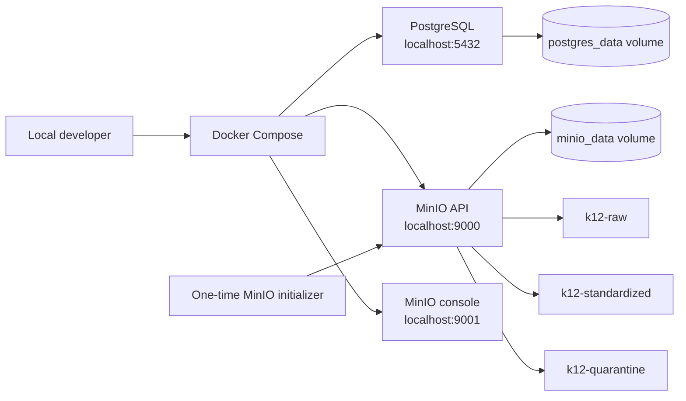

# Local Infrastructure Architecture

Prompt 2 establishes only the local persistence layer. PostgreSQL stores the future warehouse and
operational metadata, while MinIO provides separate S3-compatible buckets for raw, standardized,
and quarantined objects.

All credentials in `.env.example` are local-only defaults. Developers may override them in an
uncommitted `.env` file. Docker named volumes keep service state outside the repository.
