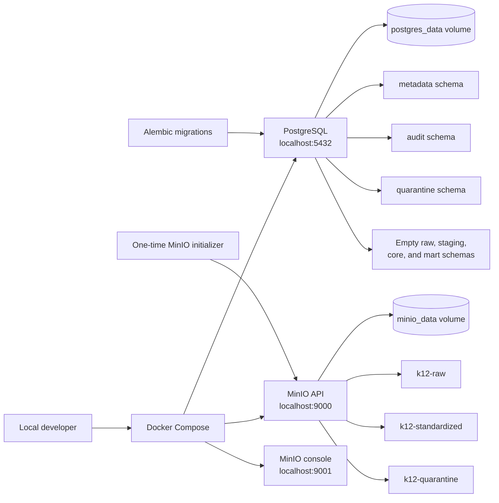

# Local Infrastructure Architecture

The local persistence layer uses PostgreSQL for operational metadata and future warehouse models.
MinIO provides separate S3-compatible buckets for raw, standardized, and quarantined objects.
Alembic owns operational tables; dbt will own analytical transformation models in a later phase.

All credentials in `.env.example` are local-only defaults. Developers may override them in an
uncommitted `.env` file. Docker named volumes keep service state outside the repository.

## Database ownership

| Owner | Schemas and objects |
| --- | --- |
| Alembic | `metadata`, `audit`, and `quarantine` operational tables |
| dbt in a later phase | Analytical models in `raw`, `staging`, `core`, and `mart` |

The initial migration creates all seven schema namespaces. It creates only operational tables:

- `metadata.source_system`, `metadata.data_contract`, and `metadata.data_quality_rule`
- `audit.pipeline_run`, `audit.source_file`, `audit.row_count_reconciliation`, and
  `audit.access_event`
- `quarantine.rejected_record`

No student, attendance, or analytical tables exist in this phase.
