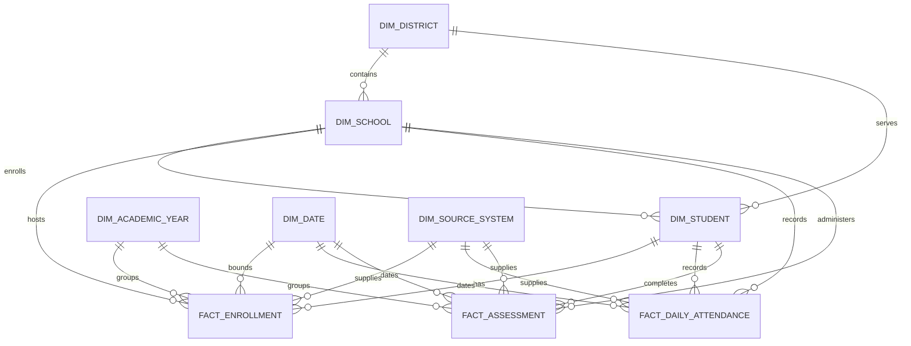

# Trusted core data model

## Trust boundary

The dbt project in `warehouse/` reads the four typed staging sources only after their pipeline's
latest data-quality run has passed. It also rejects any source row matched to a blocking
`quarantine.rejected_record`. This creates a narrow, auditable boundary between contract-valid
staging data and trusted analytical entities.

Every core entity is selected deterministically. When multiple accepted source versions represent
the same grain, dbt prefers the latest pipeline start, then the greatest immutable source-file ID
and source-row number. Facts use PostgreSQL incremental `merge` materializations with stable unique
keys, so rerunning the same accepted inputs updates existing facts instead of duplicating them.

## Entity relationships



## Model grains

| Model | Grain |
| --- | --- |
| `core.dim_district` | One trusted source district identifier |
| `core.dim_school` | One trusted source school identifier |
| `core.dim_student` | One salted student token |
| `core.dim_date` | One calendar date spanning trusted events |
| `core.dim_academic_year` | One trusted academic-year code |
| `core.dim_source_system` | One configured trusted source system |
| `core.fact_enrollment` | One accepted enrollment identifier |
| `core.fact_daily_attendance` | One student token, school, and instructional date |
| `core.fact_assessment` | One accepted assessment-event identifier |

Facts and lineage-bearing dimensions retain `pipeline_run_id`, `source_file_id`,
`source_row_number`, source system, schema version, and ingestion timestamps where applicable.
These operational values permit a record to be traced to immutable staging evidence without
carrying a direct student identifier.

## Privacy design

`core.dim_student` contains no student name, local student number, or source student identifier.
The `student_key` is a deterministic salted token generated from `K12HUB_HASH_SALT`; the same token
is used by all facts. Enrollment and assessment source identifiers are also replaced by salted
warehouse keys. A dbt schema test fails if a prohibited direct-identifier column appears in the
student dimension or facts.

The salt must be a private, stable environment value. Rotating it intentionally changes every
student key and requires a full core rebuild. District and school source identifiers remain only in
their dimensions for lineage and must not be selected into downstream marts; facts join through
warehouse keys.

## Validation

Set PostgreSQL connection variables, `K12HUB_HASH_SALT`, and
`K12HUB_EXPECTED_METRICS_PATH`. The expected-metrics file must be the aggregate-only,
synthetic-labeled `expected_metrics.json` produced alongside the validated generator run.

```sh
make dbt-debug
make dbt-build
make dbt-test
make dbt-docs
```

The build tests primary-key uniqueness and nullability, all dimension relationships, forbidden
identifier columns, and the no-orphan student/school gate. It also compares student, enrollment,
attendance, chronic-absence, assessment, proficiency, instructional-day, and academic-year results
with the generator expectations.
